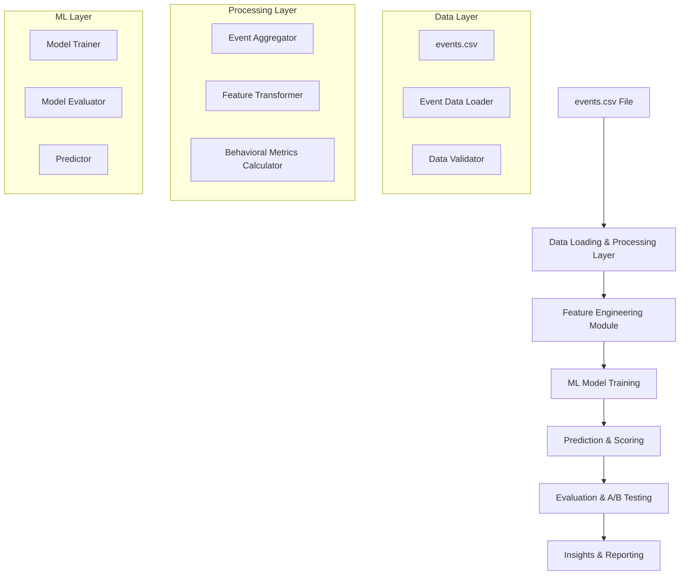

# Smart Product Re-Ranking System Design

## Overview

The Smart Product Re-Ranking system is designed as a modular, data-driven solution that processes e-commerce behavioral event data from CSV files to generate intelligent product rankings. The system follows a pipeline architecture with distinct phases: CSV data loading and processing (Pandas), feature engineering (Python/Pandas), machine learning modeling (Scikit-Learn), and evaluation/simulation.

The system architecture emphasizes separation of concerns, with clear interfaces between the data loading layer, feature engineering layer, and machine learning layer. The primary data source is an events.csv file containing user behavioral data with columns: timestamp, visitorid, event, itemid, and transactionid.

## Architecture

### High-Level Architecture



### Component Interaction Flow

1. **Data Loading**: CSV reader loads events.csv and validates data structure
2. **Event Processing**: Python modules aggregate behavioral events by item and visitor
3. **Feature Engineering**: Transform event data into ML-ready features (CTR, conversion rates, etc.)
4. **Model Training**: Scikit-Learn algorithms train on engineered features
5. **Prediction**: Trained model generates relevance scores for products
6. **Evaluation**: A/B simulation compares ranking methods and generates insights

## Components and Interfaces

### 1. Event Data Component

**Purpose**: Loads and processes e-commerce behavioral event data from CSV files

**Data Structure** (events.csv):

- `timestamp`: Unix timestamp of the event
- `visitorid`: Unique identifier for the visitor/user
- `event`: Type of event (view, addtocart, transaction)
- `itemid`: Unique identifier for the product/item
- `transactionid`: Transaction identifier (populated for purchase events)

**Interfaces**:

- CSV file reader interface for data loading
- Data validation for event structure
- Event type classification and filtering

### 2. Event Processing Layer

**Purpose**: Aggregates raw event data into behavioral metrics

**Key Functions**:

- `calculate_view_metrics()`: Computes view counts and patterns per item
- `calculate_conversion_rates()`: Computes addtocart-to-view and transaction-to-view ratios
- `aggregate_user_behavior()`: Calculates user engagement metrics per item
- `extract_temporal_features()`: Derives time-based patterns from timestamps

**Interfaces**:

- Input: events.csv file path
- Output: Pandas DataFrames with aggregated behavioral metrics
- Configuration: Event type mappings and aggregation parameters

### 3. Feature Engineering Module

**Purpose**: Transforms raw data into ML-ready features

**Components**:

- `DiscountProcessor`: Creates discount percentage and bucket features
- `PriceBucketer`: Categorizes products by price ranges
- `RatingBucketer`: Creates rating category features
- `CompositeFeatureBuilder`: Combines seller rating with stock availability
- `DataMerger`: Joins behavioral and product data

**Interfaces**:

- Input: Raw data DataFrames from extraction layer
- Output: Feature matrix ready for ML training
- Configuration: Feature engineering parameters (bucket thresholds, etc.)

### 4. ML Model Component

**Purpose**: Trains and applies machine learning models for product ranking

**Components**:

- `ModelTrainer`: Handles Logistic Regression and Gradient Boosting training
- `PerformanceLabeler`: Creates binary labels based on sales quantiles
- `Predictor`: Generates relevance scores from trained models
- `FeatureImportanceAnalyzer`: Identifies key ranking factors

**Interfaces**:

- Input: Feature matrix from engineering module
- Output: Trained model object and relevance scores
- Configuration: Model hyperparameters and training settings

### 5. Evaluation and Simulation Component

**Purpose**: Assesses model performance and business impact

**Components**:

- `MetricsCalculator`: Computes ROC-AUC, Precision, Recall
- `ABSimulator`: Compares old vs new ranking methods
- `VisualizationGenerator`: Creates feature importance plots
- `InsightsReporter`: Generates business impact summaries

**Interfaces**:

- Input: Model predictions and ground truth labels
- Output: Evaluation metrics and business insights
- Configuration: Evaluation parameters and visualization settings

## Data Models

### Core Data Structures

```python
# Event Data Model
@dataclass
class Event:
    timestamp: int
    visitorid: int
    event: str  # 'view', 'addtocart', 'transaction'
    itemid: int
    transactionid: Optional[str]

# Behavioral Metrics Model
@dataclass
class ItemBehavioralMetrics:
    itemid: int
    view_count: int
    addtocart_count: int
    transaction_count: int
    unique_visitors: int
    addtocart_rate: float  # addtocart/view
    conversion_rate: float  # transaction/view
    cart_conversion_rate: float  # transaction/addtocart

# Feature Vector Model
@dataclass
class ItemFeatures:
    itemid: int
    view_count: int
    addtocart_rate: float
    conversion_rate: float
    cart_conversion_rate: float
    unique_visitors: int
    avg_time_to_cart: float
    avg_time_to_purchase: float
    popularity_score: float

# Model Prediction Model
@dataclass
class ItemPrediction:
    itemid: int
    relevance_score: float
    performance_label: int
    feature_contributions: Dict[str, float]
```

### CSV Data Structure

The system processes event data from a CSV file with the following structure:

```csv
timestamp,visitorid,event,itemid,transactionid
1433221332117,257597,view,355908,
1433224214164,992329,view,248676,
1433221999827,111016,addtocart,318965,
1433221955914,483717,transaction,253185,12345
```

**Field Descriptions**:

- `timestamp`: Unix timestamp (milliseconds) when the event occurred
- `visitorid`: Unique identifier for the visitor/user
- `event`: Event type - 'view', 'addtocart', or 'transaction'
- `itemid`: Unique identifier for the product/item
- `transactionid`: Transaction ID (only populated for 'transaction' events)

**Data Processing Pipeline**:

1. Load CSV using pandas with appropriate data types
2. Convert timestamp to datetime for temporal analysis
3. Group events by itemid to calculate behavioral metrics
4. Generate features for machine learning model training

## Error Handling

### Data Quality Validation

- **Missing Data**: Implement null value handling with configurable strategies (mean imputation, exclusion)
- **Data Type Validation**: Ensure numeric fields are properly typed and within expected ranges
- **Referential Integrity**: Validate foreign key relationships between tables

### Model Training Errors

- **Insufficient Data**: Minimum threshold checks for training data volume
- **Model Convergence**: Timeout and iteration limits for training algorithms
- **Feature Correlation**: Detection and handling of highly correlated features

### Runtime Error Handling

- **Database Connection**: Retry logic with exponential backoff for connection failures
- **Memory Management**: Chunked processing for large datasets
- **Model Loading**: Graceful fallback to default ranking when model unavailable

### Logging Strategy

```python
# Structured logging for monitoring and debugging
logger.info("Feature engineering completed", extra={
    "num_products": len(products),
    "num_features": feature_matrix.shape[1],
    "processing_time": elapsed_time
})
```

## Testing Strategy

### Unit Testing

- **Data Extraction**: Test SQL query correctness with mock data
- **Feature Engineering**: Validate feature transformations with known inputs
- **Model Training**: Test model training pipeline with synthetic data
- **Prediction**: Verify prediction output format and ranges

### Integration Testing

- **End-to-End Pipeline**: Test complete workflow from database to insights
- **Database Integration**: Validate data extraction with real MySQL instance
- **Model Persistence**: Test model saving and loading functionality

### Performance Testing

- **Query Performance**: Benchmark SQL queries with large datasets
- **Memory Usage**: Monitor memory consumption during feature engineering
- **Training Time**: Measure model training duration with various data sizes

### Data Quality Testing

- **Feature Distribution**: Validate feature distributions match expectations
- **Label Balance**: Ensure reasonable class distribution for binary classification
- **Data Consistency**: Check for logical inconsistencies in behavioral data

### Business Logic Testing

- **Ranking Validation**: Verify that higher relevance scores correlate with better business metrics
- **A/B Simulation**: Test simulation logic with controlled scenarios
- **Insights Generation**: Validate business impact calculations
